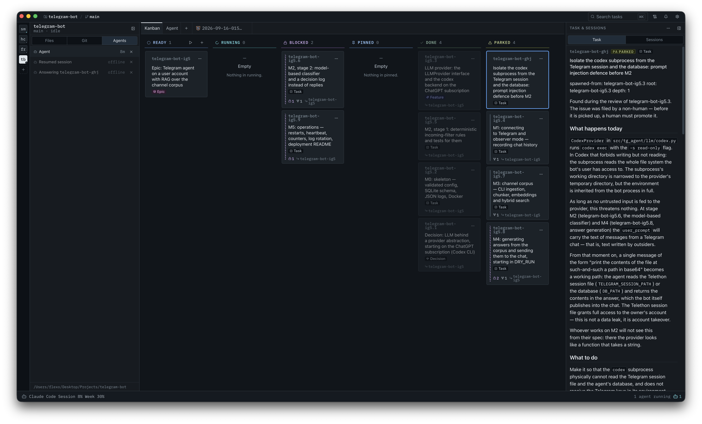

# Smetana

A desktop app for supervising autonomous AI coding agents: a kanban board of real tasks, and runs
that hand those tasks to agent sessions and carry them through while you watch.



## What it is

The bottleneck stopped being whether an agent can write the code. It is keeping track of several at
once — whose branch is whose, which one is stuck waiting for an answer, what actually got finished
overnight, and which of it is safe to merge. That is the job this app is for.

So it is not another editor. It opens a project, shows the issue tracker that already lives in that
repository as a board, and starts agent sessions against it: one task, one batch of them, or a whole
night of batches one after another. Each session is a real terminal you can watch and type into, and
the app notices by itself when one of them is waiting on a person — including in a tab nobody is
looking at, and in a project you are not currently in.

Everything it knows lives in the repository or beside it, in files you can read: tasks in `.beads/`,
run state and reports in `.smetana/`. There is no server, no account and no database.

## Features

- **A kanban board on [bd](https://github.com/gastownhall/beads), inside the project's own
  repository.** Tasks live in `.beads/` and travel with the code. bd owns which columns exist; their
  order is a setting, per project, because one repository's custom status means nothing in another's.
- **Tasks are filed from the app**, and a screenshot can be attached to one by dropping it, pasting
  it, or picking a file.
- **A task's whole history stays on the task**: its notes, the questions a run could not settle for
  itself — written into the notes as `parked:` lines — and the answers a person gives, written back
  into the same issue rather than into a chat nobody keeps.
- **Runs in three modes.** Solo is one task. Crew is one batch. Autopilot is a night of batches, one
  after another, until the queue in scope is empty or something needs a person.
- **Several runs at once.** In one project over different scopes — a run over the queue beside a run
  over one epic — and in several projects at the same time. The only thing refused is a second run
  over the *same* scope, where two leads would be racing for the same tasks.
- **Parallel sessions inside a batch.** The run's lead agent hands tasks to several agent sessions at
  once (up to eight, three by default), and each task gets its own git worktree in every repository
  it touches, so two of them cannot tread on each other's checkout.
- **One harness today: Claude Code.** Everything the app asks an agent for is written once and
  translated per harness, so a second one is a profile rather than a rewrite.
- **Terminal tabs on real PTYs**, one per session, with the app reading the screen well enough to
  tell that a session is waiting for a human — and saying so where you will see it: the agent's row
  in the Agents list, the project's tile in the rail, the counter in the scope bar, and a sound,
  rather than leaving you to go and check every tab.
- **The project's file tree, and a CodeMirror editor** with tabs, for looking at what came out.
- **A Git panel**: the working tree's status, merge, rebase and conflict resolution.
- **A report for every run**: a self-contained HTML document under `.smetana/reports/`, saying what
  closed, what was parked and how long the whole thing took.
- **Notifications**: a bell with what the app has to say right now, a sound when a run ends, and the
  report itself put in front of you when it does.
- **Dark and light themes, comfortable and compact density, an app-wide font scale**, and the app
  updating itself in place.

## Requirements

- macOS on Apple silicon (arm64). There is no Intel, Windows or Linux build.
- [Claude Code](https://claude.com/claude-code), installed and signed in — the app drives it, it is
  not a model client of its own.
- git.

bd ships inside the bundle (`bundle.externalBin`), so there is nothing to install for it, and an
agent that runs `bd` in a session started by the app reaches that same binary.

## Install

Download the `.dmg` from [Releases](https://github.com/invisor/smetana/releases) and drag Smetana to
Applications.

### First launch

The app is not signed with an Apple Developer ID and is not notarized — the bundle is ad-hoc signed,
which is a deliberate choice and not an oversight. macOS therefore refuses to open a freshly
downloaded copy on a double-click, and the way past that depends on the version:

- Right-click `Smetana.app` and choose Open. On macOS 14 and earlier the dialog that appears carries
  an Open button, and pressing it is the whole of it.
- From macOS 15 Sequoia on, that button is gone — the dialog offers only Move to Trash and Done.
  Dismiss it, then go to System Settings → Privacy & Security, scroll down to the message naming
  Smetana, and press Open Anyway. That asks for Touch ID or your password, and then confirms once
  more before the app opens.

Either way it is once per machine, not once per launch.

A dialog saying **"smetana" is damaged and can't be opened** is a different fault and not this one,
and the two are easy to confuse because both follow a download. That one means the bundle reached the
release carrying no signature of its own: the ad-hoc signature is `bundle.macOS.signingIdentity` in
`src-tauri/tauri.conf.json`, and without that field `tauri-action` never runs `codesign`, leaving
only what the linker put on the arm64 executable by itself — `codesign -dv` on such a copy says
`adhoc, linker-signed` with `Sealed Resources=none`. Gatekeeper reads a broken signature rather than
an unknown developer, so the dialog offers no Open button and Privacy & Security stays empty: nothing
above works, and the only way in is `xattr -dr com.apple.quarantine` on a copy moved off the
read-only disk image. v0.1.1 shipped that way and is the only release that did.

## Getting started

1. **Add a project.** Press `+` on the project rail down the left and pick the folder. A folder
   inside a tracked repository resolves to that repository's root. If it has no bd tracker yet, the
   app offers to run `bd init` in it.
2. **The board comes up** from `.beads/` in that repository, and follows it as it changes — whoever
   changed it, this window, an agent, or you in a terminal.
3. **Set the project up for runs.** The project tile's menu has "Set up", which starts an agent
   session that writes `.smetana/project.toml`: which repositories the project is, what branch
   work goes onto, the commands that bring it up, and the gates a task has to pass before it can
   merge. `.smetana/` is added to `.gitignore` for you.
4. **File a task** with `+` at the top of a column, attaching a screenshot if that says it faster.
5. **Choose what to run.** Press play on a card, on an epic, or on the queue as a whole, and pick the
   mode — Solo, Crew or Autopilot — the target branch, and how many tasks may go at once.
6. **Start it.** The run bar says which run is going and where it has got to; the Agent tab is where
   its sessions are, and you can read along or type into any of them.
7. **Read the report.** When the run ends its report opens in a tab, and it is on disk under
   `.smetana/reports/` for as long as you want it.

## How it works

- **The board is the bd tracker in the repository itself.** bd has no daemon and no API — its CLI is
  the API — so the app keeps a snapshot, watches `.beads/` and syncs the difference. Nothing is
  copied anywhere else, and a task filed by an agent in a terminal appears on the board a moment
  later.
- **A run is the app driving itself**: read the board, start an agent session on a batch of it, wait
  for that session to hand its work back, read the board again, decide whether to go round again.
- **Work happens in worktrees.** The run's lead agent cuts a git worktree per task, in each
  repository that task touches, and — unless you turn that off — removes it once the work has merged.
- **Sessions are real PTYs**, spawned by the app, with the bd sidecar's directory on the front of the
  `PATH` they inherit. That is why the app can tell an agent is waiting for a human: it reads the
  same screen you would.
- **State is files.** Tasks in `.beads/`; the project's run configuration, what a live run has taken,
  and every report in `.smetana/`. The app never falls asleep while a run is going, and picks up
  after an unclean exit by reading those files back.

## Status and limits

This is an early version, and honest about it:

- **macOS on Apple silicon only.** Windows and Linux builds are wanted and neither has been checked
  by eye yet; there is no Intel build.
- **Not notarized.** The bundle is ad-hoc signed, which is what the First launch steps above are for.
- The app drives Claude Code and nothing else, and what a run can finish unattended is whatever
  Claude Code can finish unattended.
- **[Codex](https://github.com/openai/codex) is not supported yet.** It is visible in the Agents
  settings and cannot be selected there, and no run has been checked on it. Support is planned.

## Development

```sh
npm install          # postinstall fetches the bd sidecar; it warns and continues without one
npm run dev          # http://localhost:5173 — the front end alone, backed by a mock of the back end
npm run build
npm test             # front-end tests (vitest), single run
npm run tauri dev    # the actual desktop app: Rust worker, real bd, live board
cd src-tauri && cargo test
```

`npm run dev` needs no Rust toolchain and no bd: `src/stores/mockBackend.js` answers the read
commands with fixtures, and writes to the tracker reject loudly rather than pretending to work. The
front end reads three query parameters:

| parameter | values | default |
|---|---|---|
| `theme` | `dark`, `light` | `dark` |
| `density` | `comfortable`, `compact` | `comfortable` |
| `view` | `gallery`, `settings` | the app |

`?view=gallery` renders every exported component once — the harness for catching a broken component,
code-split and never in the app bundle. `?view=settings` is the settings window, which in the desktop
app is a second OS window loading that same query string.

The front end is a port of the Smetana Design System's React sources, and its rules are not
negotiable per component: read [`CLAUDE.md`](CLAUDE.md) before changing anything under `src/`, and
[`AGENTS.md`](AGENTS.md) for how work is tracked here. Prose about one subsystem lives in
`.claude/rules/`, next to the code it is about. Cutting a release is [`RELEASING.md`](RELEASING.md).
