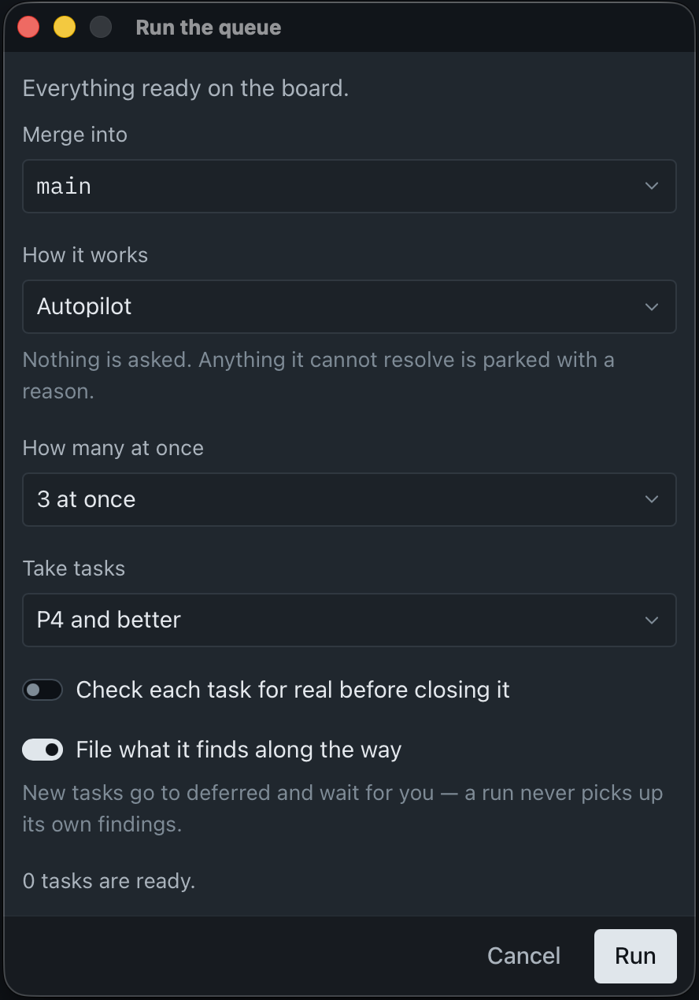

<h1 align="center">
  &nbsp;Smetana
</h1>

  
  
  
  

  <a href="README.md">English</a> ·
  <b>Русский</b> ·
  <a href="README.zh.md">中文</a>

  <b>Автономная разработка. Заведите задачи, запустите ран, идите за кофе.</b> 
  Опишите, что нужно, — агент заведёт задачи, спросит обо всём, что не смог решить сам, и расставит
  между ними блокировки и зависимости. Вы нажимаете play один раз; дальше ран проходит очередь сам.
  Вам остаётся прочитать результат.

<h3 align="center"><a href="https://github.com/invisor/smetana/releases/latest">Скачать Smetana</a></h3>

## Что это

Smetana — ADE, agentic development environment: среда разработки, построенная вокруг агентов. Не
редактор с приделанным сбоку чатом, а место, где вы говорите, что должен делать продукт, а работу
делают агенты. Внутри приложения едут две вещи. Канбан-трекер
[bd](https://github.com/gastownhall/beads), который держит задачи в вашем собственном репозитории, а
не на чьём-то сервере. И библиотека скиллов [Superpowers](https://github.com/obra/superpowers) —
оттуда агент берёт метод: как допросить задачу, как её спланировать, как отревьюить изменение, как
его смержить.

### Как проходит работа

1. **Вы описываете её своими словами.** Абзац, скриншот; никакой тикет-дисциплины не требуется.
2. **Агент расспрашивает.** Он проходит с вами по всему неоднозначному, пока не останется ничего
   важного, что пришлось бы угадывать.
3. **Агент заводит задачу** — одну или несколько, с расставленными между ними зависимостями — и
   кладёт её в Ready.
4. **Вы запускаете ран**, указав ветку git, в которую должен лечь результат.
5. **Ран берёт пачку из Ready** и ведёт задачи параллельно там, где они это позволяют, каждую в своём
   worktree, так что две не топчутся в одном чекауте.
6. **Он мержит то, что прошло**, в эту ветку — вместе с конфликтами.
7. **Берёт следующую пачку**, и следующую, пока Ready не опустеет.
8. **Вы поднимаете проект и смотрите, что получилось.**

Приложение старается держать человека вне цикла везде, где это честно. Завести задачу, отредактировать
её, разрешить конфликт при мерже, решить, что ветка годна к слиянию, — это работа самого агента, и
вас спрашивают только там, где без вас не обойтись: вопросом в заметках задачи или раном, который
остановился и назвал задачу. Всё, что приложение знает, лежит в файлах, которые можно открыть: задачи
в `.beads/`, состояние ранов и отчёты в `.smetana/`. Ни сервера, ни аккаунта, ни базы.

## Канбан-доска

Столбец — это статус задачи, и доска рисует все статусы проекта. Вот те, вокруг которых построена
работа:

- **Ready** — готова к работе: вопросы отвечены, план реализации написан там, где он был нужен, и
  ничего незавершённого её не держит. Ран берёт пачку задач отсюда.
- **Running** — над задачей работают прямо сейчас: агент взял её и занят ею.
- **Blocked** — сюда попадают карточки двух видов. Одна ждёт другую задачу — то, от чего она зависит,
  ещё не доделано — и сама уйдёт в Ready, как только та закроется. У второй бейдж замка: её
  заблокировал человек руками, и вернуть её обратно может только он же, сняв замок.
- **Parked** — в работе всплывает то, чего нельзя было предвидеть, пока задача писалась, и часть
  этого требует человека. Агент, наткнувшийся на такое посреди рана, паркует задачу: вопрос уходит в
  её заметки, а кнопка **Answer questions** запускает агента, который задаст его вам и вернёт задачу
  в Ready. Сам ран при этом продолжается — текущий батч заканчивается, следующий берётся из Ready без
  всего, что зависело от припаркованной задачи. Ран останавливает только тот же самый вопрос,
  пришедший во второй раз.
- **Ready to merge** — сделано и отревьюено, ждёт слияния в целевую ветку. Закроется, когда попадёт
  туда.
- **Human check** — сделано и смержено, ждёт, чтобы кто-то посмотрел глазами. Ран оставляет такую
  задачу, когда не смог проверить работу сам: вы смотрите и либо закрываете её, либо отправляете
  обратно в Ready.
- **Done** — закончено и закрыто.
- **Deferred** — отложено намеренно, при том что ничего её не держит. Сюда же падают находки,
  всплывшие в работе над другой задачей: агент, споткнувшийся о баг, заводит его в Deferred, а не в
  Ready, и это сделано нарочно — ран, подбирающий собственные находки, никогда не дошёл бы до конца
  очереди. Вернуть такую задачу в Ready может только человек.
- **Pinned** — в работу не берётся никогда. Иначе говоря, бэклог: задачи, которые будут сделаны
  когда-нибудь, но не сейчас.
- **Hooked** — агент забрал целую группу связанных задач разом. Статус говорит, чья это работа, а не
  насколько она продвинулась; ран такие задачи не трогает.

Проект может завести собственные столбцы. Любой статус, который есть в bd, становится столбцом — с
цветом и двухбуквенным кодом, которые приложение подбирает само.

## Раны

Ран — это процесс внутри приложения, который ведёт работу сам: читает доску, отдаёт пачку задач
агентским сессиям, дожидается их, мержит то, что прошло, и читает доску снова. Каждый батч получает
собственную сессию, так что контекст каждый раз начинается с чистого листа. За подпиской ран следит
тоже: когда лимит исчерпан, он встаёт на паузу там, где стоял, и продолжает, как только лимит
восстановится.

Ран запускается по одной задаче, по эпику или по всей очереди Ready. Дальше вы говорите, куда должен
лечь результат — целевая ветка, — сколько задач вести одновременно (от одной до восьми, по умолчанию
три) и, для очереди, порог приоритета, ниже которого задачи не берутся (по умолчанию P2 и выше).

**Solo** — одна задача, и агент делает работу сам, не передавая её никому. Он свободно спрашивает вас
по ходу и ждёт ответа, прежде чем продолжить. Предлагается только там, где вы указали конкретную
задачу: для эпика и очереди «в одиночку» смысла не имеет. Режим для максимального контроля.

**Crew** — агент-лид, работающий с сессиями-тиммейтами. Вопрос тиммейта — забота лида, и до вас
доходит только то, чего лид не смог решить сам; задача при этом не паркуется, пока вы думаете, —
сессия вас ждёт. Ран Crew берёт ровно один батч, мержит его, и на этом заканчивается: потому это и
режим для того, чтобы держаться рядом с работой.

**Autopilot** — кодинг, когда в комнате никого. Ран берёт пачку из Ready, доводит её до мержа, берёт
следующую и идёт так, пока очередь в его области не опустеет или пока не упрётся в то, что требует
человека. Всё, что требует человека, паркуется с вопросом в заметках задачи, а ран продолжает со
всем, что от неё не зависит. Сессии здесь беспилотные: сделали работу и завершились.

В Crew и Solo сессия переживает ран — она стоит на своём приглашении, с ней можно продолжить
разговор, и окончание рана её не закрывает. В Autopilot — нет: этот режим рассчитан на комнату, в
которой никого.

**Ранов может идти несколько сразу**: по разным областям в одном проекте — очередь рядом с отдельным
эпиком — и по нескольким проектам одновременно. Запрещено ровно одно: второй ран по *той же* области,
где два лида дрались бы за одни и те же задачи.

Ко всему этому прилагаются два переключателя. **Check each task for real before closing it**
отправляет агента поднять проект и проверить работу вживую, а не полагаться на собственные тесты.
**File what it finds along the way** разрешает ему записывать баги, о которые он споткнулся, — в
Deferred, никогда в Ready.

  

Чем бы ран ни закончился, он пишет отчёт — самодостаточный HTML-документ в `.smetana/reports/`, где
сказано, что закрыто, что припарковано, сколько всё это заняло и каким режимом делалось.

## Требования

- **macOS на Apple silicon (arm64)** — единственная выпущенная сборка и единственная платформа, на
  которой приложение работало. Windows и Linux нужны и запланированы: Tauri собирается под обе, в
  релизном workflow под каждую ждёт своя строка, и ни одна пока не проверена глазами.
- **CLI-харнесс, установленный и залогиненный** — [Claude Code](https://claude.com/claude-code) или
  [Codex](https://github.com/openai/codex). Приложение управляет тем инструментом командной строки,
  который у вас уже есть; это не клиент модели, и ключей оно не держит. Поддерживаются оба, но почти
  всё тестирование до сих пор шло на Claude Code.
- **git.**

## Установка

Скачайте `.dmg` со страницы [Releases](https://github.com/invisor/smetana/releases) и перетащите
Smetana в Applications. Приложение подписано Apple Developer ID и нотаризовано, поэтому открывается
двойным щелчком: ничего не нужно закрывать и ничего не нужно разрешать заранее.

## С чего начать

1. **Добавьте проект.** Нажмите `+` на рейке проектов слева и выберите папку. Папка внутри
   отслеживаемого репозитория разрешается в его корень, а если трекера bd в нём ещё нет, приложение
   предложит выполнить `bd init`.
2. **Доска поднимется** из `.beads/` этого репозитория и дальше будет следовать за ним — кто бы его
   ни менял: это окно, агент или вы в терминале.
3. **Настройте проект для ранов.** В меню плитки проекта есть **Set up**: он запускает агентскую
   сессию, которая расспросит о проекте и напишет `.smetana/project.toml` — из каких репозиториев
   состоит проект, в какую ветку идёт работа, какими командами он поднимается и какие гейты задача
   должна пройти перед мержем. `.smetana/` добавляется в `.gitignore`, так что в репозиторий ничего
   из этого не попадает.
4. **Заведите задачу** кнопкой `+` над столбцом. Напишите своими словами, что нужно; об остальном
   спросит агент.
5. **Нажмите play** — на карточке, на эпике или на очереди — и выберите режим, целевую ветку и
   сколько задач вести одновременно.

## Как поучаствовать

Приложение раннее и делается открыто, потому что иначе шероховатости не находятся. **Что-то
сломалось? [Заведите issue](https://github.com/invisor/smetana/issues)** — расскажите, что вы
пытались сделать, когда всё пошло не так. **Идея, пожелание, вопрос о том, как этим пользоваться?
[Начните обсуждение](https://github.com/invisor/smetana/discussions).** Дорожная карта намеренно
короткая, и то, о чём люди действительно просят, двигается по ней вверх.

**Помощь с кодом тоже нужна.** Четыре вещи сейчас помогут больше всего:

- **Проверить сборки под Windows и Linux.** В релизном workflow под каждую платформу ждёт своя
  строка; на них приложение ещё никто не запускал.
- **Ночь на Codex.** Поддерживаются оба харнесса, но почти всё тестирование до сих пор шло на Claude
  Code.
- **Профили агентов для других харнессов.** Всё, что приложение просит у агента, написано один раз и
  переводится под каждый харнесс, так что третий — это профиль, а не переписывание.
- **Всё, что у вас сломалось**, — с приложенным отчётом рана из `.smetana/reports/`, если ран был: в
  нём сказано, что приложение считало происходящим.

Прежде чем менять что-либо под `src/`, прочитайте [`CLAUDE.md`](CLAUDE.md): фронтенд — это порт
дизайн-системы, и её правила не обсуждаются покомпонентно. [`AGENTS.md`](AGENTS.md) — то же самое для
агентов, работающих в этом репозитории.

## Лицензия

[MIT](LICENSE).
