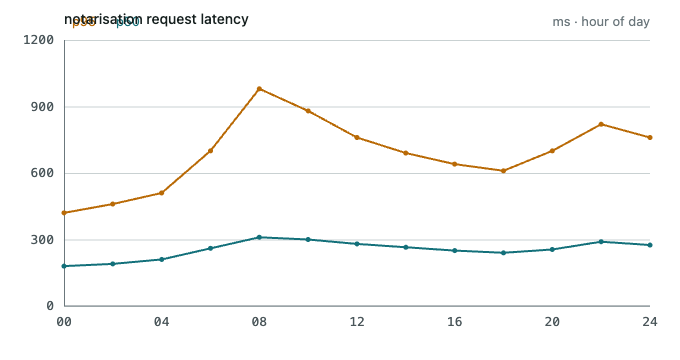

# Conversation panel — markup contract

Everything the renderer may emit inside the conversation panel, and the exact
shape it must emit it in. `sm-prose.css` styles nothing that is not listed here,
and nothing here carries a class or an inline style: the styling keys on element
names and `data-` attributes only.

Files:

| file | what it is |
|---|---|
| `sm-prose.css` | the stylesheet — every rule scoped under `.sm-prose` |
| `sm-prose-turns.css` | the three turn treatments not taken, plus the earlier `rail` default |
| `sm-prose-tokens.css` | the tokens this design needs and the system does not have yet |
| `Conversation panel.dc.html` | the four rendered combinations (dark/light × comfortable/compact) |
| `Turn variants.dc.html` | the turn-treatment exploration the default was chosen from |
| `Panel.dc.html` | one panel: chrome, the specimen session, the composer |

Theme and density are attributes on the document root — `data-theme="dark"`,
`data-density="compact"` — and the stylesheet never branches on anything else.
The design-system token files do the branching; `sm-prose.css` only spends
tokens. (The four-up board sets `data-theme` on a pane wrapper instead of the
root, because both attribute selectors in the token files are unscoped. That is
a demo affordance, not a second mechanism.)

---

## 1 · Root and turns

```html
<div class="sm-prose">
  <article data-turn="person">…</article>
  <article data-turn="agent">…</article>
  <hr data-session>
</div>
```

- `.sm-prose` is the only class in the whole contract. It is a flex column; the
  gap between turns is the only vertical spacing the panel owns, so a turn never
  has to zero a margin at its ends. The person's turn sits on the right of that
  column by `align-self`, which is why the column is flex and not block.
- `article[data-turn="person"]` — a bubble on its own side: raised surface,
  `--card-pad` inset, `max-width:88%`, `align-self:flex-end`, and the
  bottom-right corner squared to `--radius-1` while the other three stay at
  `--radius-4`. The squared corner is the tail and it points back at the
  sender; no drawn triangle, nothing for the sanitiser to allow. **Side and
  shape carry the distinction** — there is no hue in it, because saturated
  colour belongs to status.

  Three treatments not taken live in `sm-prose-turns.css` behind
  `data-turn-style` on the prose root — `bubble-left`, `sliver-right`, `ledger`
  — together with `rail`, the earlier left-bar default, which was dropped
  because a left bar is what a quotation uses and this panel's own blockquote
  is two steps away from it.
- `article[data-turn="agent"]` — no container, no avatar, no caption. It is the
  ground of the panel.
- `hr[data-session]` — a full-bleed break between sessions, distinct from an
  `hr` inside a message.

**Attachments** (person's turn only, always last):

```html
<ul data-attachments>
  <li><span data-attachment-name>ci-notarize.log</span><span>12 KB</span></li>
  <li><button type="button">tauri.conf.json</button><span>4 KB</span></li>
</ul>
```

Mono chips carrying the file name, never a thumbnail — the name is what a person
searches for. The optional `<span>` is the size, muted, inline after the name.
The chip truncates with an ellipsis; it never wraps.

The name is a `button` (smetana-4x3w) when there is somewhere for a click to
go — the image window for a picture, an editor tab for anything else inside
the open project — and `span[data-attachment-name]` otherwise: an attachment
that is neither a picture nor inside the project has no channel this app can
open it through (`files_read` refuses a path outside the project root, and
`openExternal`'s own allow-list is `http`/`https` alone), so it is plain
text — no button, no cursor, no hover — the same discipline a disabled
control keeps elsewhere in this system. There is no cross to remove it
here — this half of the chip is sent — so the whole of it is the one
control, when there is one at all.

---

## 2 · Prose

Plain markdown output, no attributes:

`p` `strong` `em` `del` `small` `kbd` `code` `ul` `ol` `li` `dl` `dt` `dd`
`blockquote` `hr` `h1`–`h6`

Decisions worth knowing:

- **Headings do not scale like a document.** h1 18px + a strong rule, h2 15px +
  a hairline rule, h3/h4 body size at two weights, h5 12px secondary, h6 the
  system's 10px mono caps micro-header. In a 420px column, size is the scarcest
  resource; weight and rules separate levels instead. h4–h6 stop growing and
  become labels — that is the quiet degradation.
- **Inline `code`** is recessed (`--surface-sunken`, hairline, `--radius-2`).
  Anything more elevated reads as a button in a column that contains real
  buttons.
- **Nested lists**: level 1 is a disc, level 2 is an en dash, level 3 is a
  circle, so two levels never look like one list. `ol` markers are mono and
  muted; an `ol` inside a `ul` keeps decimal numbering. A numbered list hangs
  wider than a bulleted one, and the same amount in both densities: the
  marker is a string three mono characters long where a disc is a dot, and an
  indent that does not hold it puts the number outside the panel rather than
  dropping it.
- **Task lists** — the box is **drawn in CSS**, not `<input type="checkbox"
  disabled>`:

  ```html
  <ul data-task>
    <li data-checked>Reproduce the ad-hoc fallback locally</li>
    <li>Re-run the release workflow</li>
  </ul>
  ```

  Why not the input: a native control renders as three different pieces of
  platform chrome across WebKitGTK / WKWebView / WebView2, cannot be coloured
  from the token set without `appearance:none` (at which point it is drawn
  anyway), and reads as operable when it is not — this is a transcript, the
  state is already decided. A checked item also goes `--text-muted`: done is
  quiet.
- **`blockquote`** is a left rule plus secondary text, never italic — italic at
  13px in a system stack is mush. One nested level drops to the subtle rule and
  muted text.
- **First and last child**: one rule each (`.sm-prose :first-child` /
  `:last-child`) over a `:where()` base of zero specificity. No stray margin at
  either end of a turn, a list item, a quote or a disclosure.

---

## 3 · Tables

```html
<div data-table-scroll>
  <table>
    <thead><tr><th>Step</th><th>Local</th><th data-align="right">ms</th></tr></thead>
    <tbody><tr><td>identity</td><td><code>Developer ID Application</code></td>
               <td data-align="right">12</td></tr></tbody>
  </table>
</div>
```

- Alignment is **`data-align="left|center|right"`**, not `style="text-align:…"`.
  One attribute for the sanitiser to allow beats opening `style` on every cell,
  and the stylesheet can then give right-aligned cells mono tabular figures —
  which is what "right-aligned" means in this app.
- Every table is wrapped in `div[data-table-scroll]`. The wrapper owns the
  border, the radius and the horizontal scroll, so the table itself never has to
  clip anything.
- **Wider than the panel**: the renderer adds `data-wide` when the table has
  more than four columns or a declared minimum. The wrapper scrolls; the panel
  never grows. The affordance is an **always-drawn trough**
  (`--prose-scroll-track` + `--prose-scrollbar-h`) — overlay scrollbars would
  hide the one signal that the block continues past the right edge, and a fade
  would need a gradient, which this system does not have.
- **Long unbreakable cell**: cells wrap on word boundaries; `code` and `a`
  inside a cell may break anywhere. That keeps a 40-character cdhash inside the
  column without breaking ordinary prose mid-syllable, which is what
  `overflow-wrap:anywhere` on every cell did.
- **Ruled, not zebra.** Zebra lays a second rhythm over a column that already
  alternates raised person turns against plain agent ground, and stripe fills
  are the first thing to go muddy at compact density, where rows sit 4px apart.
  Hairline row rules and a weighted header do the same work with one border.

---

## 4 · Code blocks

```html
<figure data-code data-lang="bash">
  <figcaption>bash</figcaption>
  <button type="button" data-copy data-state="idle" aria-label="Copy code">
    <svg data-icon="copy" …></svg>
    <svg data-icon="check" …></svg>
    <span>Copy</span>
  </button>
  <pre><code>xcrun notarytool submit …</code></pre>
</figure>
```

- `figcaption` is the language, and only exists when the fence declared one.
  `data-lang` is reserved for the highlighter that is out of scope here; the
  stylesheet does not read it.
- The figure is a **2-column grid**: a header band (row 1) and the code
  (row 2, spanning). The copy control lives **in the band**, not floating over
  the code — an absolutely positioned control collides with a long first line
  exactly when that line is worth copying.
- **Always visible, never hover-revealed.** This panel is read by keyboard as
  much as by pointer, and a control that appears on hover is a control that is
  not there when you tab to it. Its resting weight is muted text on the band, so
  it costs almost nothing against the loudness budget.
- `pre` scrolls horizontally, `white-space:pre`. **Code never wraps.**
- States: resting (muted) → hover (`--surface-hover`, hairline appears) →
  active (`--surface-active`) → focus-visible (2px `--focus-ring`, inset offset
  so the clipped figure cannot eat it) → **copied**: the app sets
  `data-state="copied"` and swaps the label to "Copied"; CSS swaps the glyph to
  the tick. The confirmation is the control changing — no toast, no colour
  flash. Revert after `1600ms`.

---

## 5 · Links

```html
<!-- external: leaves the app, opens in the person's browser -->
<a href="https://developer.apple.com/…">notarizing macOS software</a>

<!-- local: opened in the editor or revealed in the file manager -->
<a data-path="src-tauri/tauri.conf.json" data-kind="file"
   href="file:///Users/flexo/…/tauri.conf.json">
  <span data-head>src-tauri/</span><span data-tail>tauri.conf.json:41</span>
</a>
```

- The distinction is **`data-path` + `data-kind="file|dir"`**, never the href
  shape. `href` stays for native focus, middle-click and copy-link; the app
  intercepts the click. The stylesheet never guesses.
- External: sans, `--text-link`, `--prose-external-glyph` (`↗`) after it,
  underline on hover only — the system's link rule.
- Local: mono (it is an identifier) with a **permanent hairline underline**,
  because it sits in text that is already full of mono that does nothing.
  `data-kind="dir"` appends `/`.
- **Middle truncation** is done in the markup, because CSS cannot do it: the
  renderer splits the path into `[data-head]` (truncates with an ellipsis) and
  `[data-tail]` (never truncates — the file name and line number). Inline, the
  link is an `inline-flex` that yields to the sentence; as the only child of a
  `p` it takes the full column, so the head truncates as late as possible.
- Both take the 2px `--focus-ring`.

---

## 6 · The agent is working

One strip, four moments — same element, same place, different mark and words, so
the transition reads as one thing progressing:

```html
<div data-activity="waiting"   role="status"><span data-mark></span><span>claude-1 is thinking</span><time>4s</time></div>
<div data-activity="streaming" role="status"><span data-mark></span><span>claude-1 is responding</span><time>12s</time></div>
<div data-activity="done"><span>72 515 in · 1 204 out · $0.81</span><time>13.0 s</time></div>
<div data-activity="failed"><span data-mark></span><span>exit 101 in wt/bd-3c9d</span><time>2m 14s</time></div>
```

- **Waiting does not spin.** The elapsed clock is the liveness signal — it is
  the answer to the only question being asked — and the mark beside it fades on
  the system's `--dur-pulse` rather than blinking. `prefers-reduced-motion`
  stops the fade; the clock still ticks.
- **Done** turns the strip into the turn's receipt: mono, quiet, at
  `--attn-quiet-opacity`. Nothing else in the column changes when a turn ends.
- **Failed** is the one place the strip takes a saturated colour, because failed
  is a status: `--status-failed-fg`, and the mark becomes a square — the
  system's silhouette for failed.

**Streaming edge.** The partial message is ordinary prose; the live edge is one
element the renderer moves:

```html
<p>The identity is read once and passed down as<span data-edge></span></p>
```

A `--prose-caret-w` bar in `--attn-live`, pinned to the last character produced,
fading on the same pulse. Nothing else about a partial message differs from a
finished one — which is the point: no reflow when it completes.

**Reasoning** — the agent working something out, not the agent speaking:

```html
<details data-reasoning>
  <summary>Reasoning<time>18s</time></summary>
  <p>Two candidates. Either the runner has no identity in its keychain…</p>
</details>
```

Folded by default, left rule, 12px, `--text-muted` — dimmed by **colour and
size, not opacity**, so it still clears the contrast floor when open. The
disclosure marker is ours: two borders rotated 45°, rotating to 45° again on
`[open]` over `--dur-fast`. The platform triangle is hidden
(`list-style:none` + `::-webkit-details-marker{display:none}`).

---

## 7 · Illustrations

Two accepted forms, and the difference between them **is** the answer to the
dark-theme failure case.

```html
<!-- raster read off disk through image_read: matted, and the one form with an expand control -->
<figure data-figure>
  
  <figcaption>Notary latency, 24 h</figcaption>
  <button type="button" data-expand aria-label="Open full size"><svg …></svg></button>
</figure>

<!-- token-drawn vector: no mat, follows the theme, no expand control — see below -->
<figure data-figure>
  <svg viewBox="0 0 320 60" role="img" aria-label="Pipeline: build, sign, notarise, staple">…</svg>
  <figcaption>Release pipeline.</figcaption>
</figure>

<!-- loading / failed -->
<figure data-figure data-state="loading"><div data-placeholder></div><figcaption>Queue depth, 7 d</figcaption></figure>
<figure data-figure data-state="error">
  <div data-placeholder><strong>Failed to render</strong><span>unexpected token at line 4 · assets/queue-depth.svg</span></div>
  <figcaption>Queue depth, 7 d</figcaption>
</figure>
```

- **The mat.** `` always sits on `--prose-figure-mat` — deliberately the
  *same* paper value in both themes — inside a border. A PNG that carries its
  own white ground then reads as a pinned print, intentional and bordered,
  instead of a hole cut in a dark panel; and a transparent PNG drawn in dark ink
  stays legible. Inline `<svg>` is the **preferred** form and is accepted only
  when it paints with `currentColor` and `var()` tokens — it gets no mat,
  because it is part of the panel. The renderer enforces that rule; the
  stylesheet stops guessing. (Text inside an agent-drawn diagram is styled by
  us: mono, `--text-2xs`, `fill:currentColor`.)
- **The frame** is a 2-row grid: the picture, then a caption row. The caption
  row is always present; `figcaption` is optional. **Superseded by the
  decision below**: this paragraph originally went on to say the row always
  carries the expand control, right-aligned, in the same family as the copy
  button, whatever the figure — read that as history rather than as the
  current rule.
- **The expand control is not the row's floor any more, and it does not
  appear on every figure.** Decided when smetana-je5v was unparked, once the
  renderer actually read a path's bytes rather than only accepting the
  markup: the control opens the file `image_read` resolved, in the app's
  image window, and there is a file behind it for exactly one of these forms
  — a raster source read off disk by path. A `data:` source, raster or
  vector, and a validated inline `<svg>`, carry no such file and draw no
  control; neither does a figure still loading or one that failed, since
  `image_read` has not answered yet or answered with a refusal rather than a
  path. The frame is unaffected — see the loading and failed examples above,
  which never carried the control at all — and the caption row keeps its
  height and background with or without one: `MarkdownFigure.vue` renders
  `<figcaption>` unconditionally for exactly this reason, empty where the
  agent gave no caption, so the row is never held up by a control that may
  not be there.
- **Wider than the panel**: `width:100%`, `height:auto` — it scales to fit and
  `data-expand` opens it full size in a window of its own.
- **Loading**: `div[data-placeholder]` at `--prose-figure-loading-h`, pulsing on
  `sm-skeleton`. The frame and caption are already correct, so nothing jumps
  when the picture arrives.
- **Failed**: the same placeholder says what happened and where, in mono, with
  the heading in `--status-failed-fg`. The frame stays. The reason leads and
  the source follows — a `data:` source can run to hundreds of characters and
  clip the line if it came first, where the reason is the part worth reading
  at a glance.
- **Two in a turn**: `div[data-figures]` — a wrapping flex row,
  `flex:1 1 var(--prose-figure-min)`. They wrap rather than crush below the
  minimum.

---

## 8 · Proposed tokens

All in `sm-prose-tokens.css`, with roles. Aliases (gaps, rules, surfaces) are
declared on `.sm-prose` itself and need no new names — note that they *must* be
declared there rather than on `:root`, because a custom property substitutes
`var()` at the element where it is declared, so a density-dependent alias
written on `:root` would freeze at the root's density.

| token | role |
|---|---|
| `--prose-figure-mat` | the fixed neutral mat behind raster illustrations; identical in both themes |
| `--prose-figure-min` | narrowest a figure may get in a two-up row before the row wraps |
| `--prose-figure-loading-h` | height of the skeleton stand-in before an illustration arrives |
| `--prose-table-wide-min` | width below which compressing a table is worse than scrolling it |
| `--prose-box` | task-list box, drawn |
| `--prose-tick-w` / `--prose-tick-h` | the two arms of the drawn tick |
| `--prose-chevron` | disclosure marker arm |
| `--prose-dot` | activity mark |
| `--prose-caret-w` | streaming live edge |
| `--prose-icon` | copy / expand glyph box |
| `--prose-scrollbar-h` | height of the always-drawn horizontal trough |
| `--prose-scroll-track` / `--prose-scroll-thumb` | that trough's two parts |
| `--prose-external-glyph` | the "leaves the app" glyph, as content |
| `--prose-dir-glyph` | the "target is a folder" glyph, as content |
| `--prose-meta-sep` | the system's `·` separator, as content |

---

## 9 · Sanitiser allowlist

Elements: `p h1 h2 h3 h4 h5 h6 strong em del small kbd code pre ul ol li dl dt
dd blockquote hr table thead tbody tr th td a img svg figure figcaption details
summary article div span time button`

Attributes: `class` (`sm-prose` only), `data-turn data-attachments data-task
data-checked data-align data-wide data-table-scroll data-code data-lang
data-copy data-state data-path data-kind data-head data-tail data-figure
data-figures data-placeholder data-activity data-mark data-edge data-reasoning
data-icon data-expand data-session`, plus `href src alt width height type
role aria-label aria-hidden open datetime` and the SVG geometry/presentation
attributes needed by an agent-drawn diagram.

**No `style` attribute anywhere.** That is the whole reason this is a stylesheet
over a contract.

---

## 10 · Build target

`es2021` / `chrome100` / `safari15`. No `:has()`, no container queries, no
nesting. `:where()` (chrome 88 / safari 14) carries the zero-specificity base.

Three properties are newer than the target and are used as progressive
enhancement only — all three fall back to the browser default with no layout
consequence, and nothing's size, spacing or colour depends on them:

- `text-wrap: pretty` / `balance` (chrome 117 / safari 17.5)
- `::marker { font-family }` (safari 17)
- `scrollbar-color` (safari 18) — the `::-webkit-scrollbar` rules cover WebKit,
  and the two declarations are redundant on purpose.
